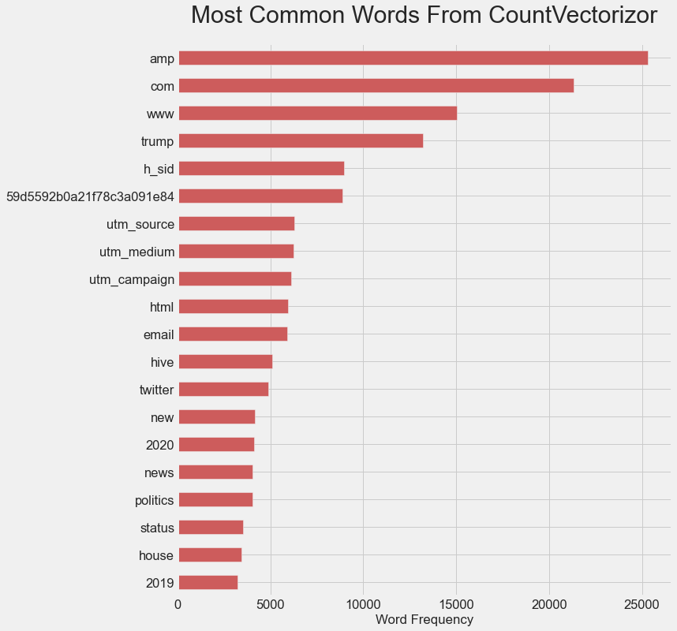
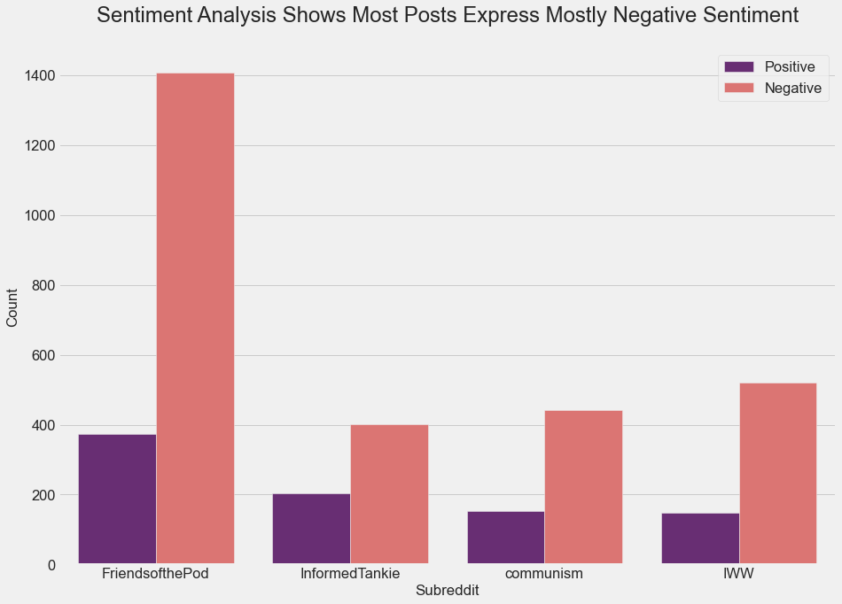
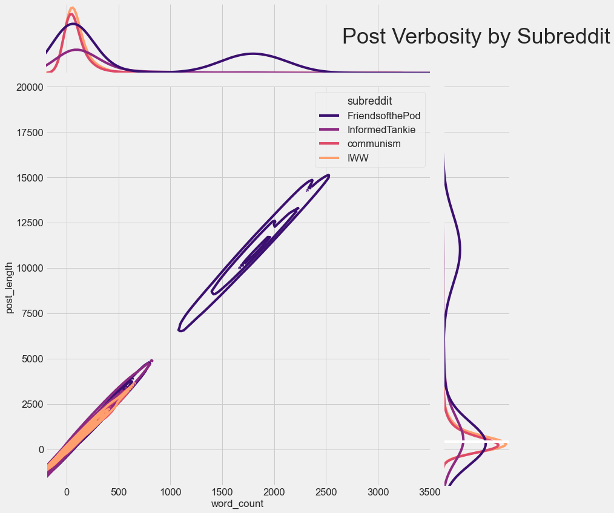
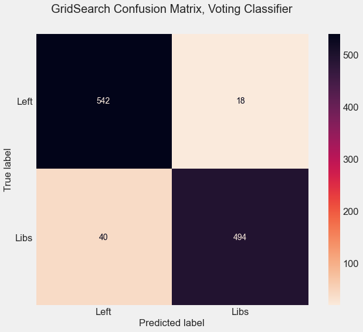

## Friend of the Pod?
#### Notebook by Ryland Matthews
- - - -

## Problem Statement
It’s very common in the United States, especially in political media, to hear Liberals and the Left referred to interchangeably, but is this really the case? In a sample poll, 100% of my uncles were either unable to tell them apart, or at least considered it a distinction without a difference
But, with a little web scraping and some natural language processing, can we prove that it’s not very hard to tell the Liberals apart from the Left?


## Hypothesis?
Are Liberals and the Left impossible to distinguish from one another?


## The Dataset
There aren't entirely analagous Liberal and Left subreddits, but I believe I chose two that illustrate the differences well. I knew early on that I wanted Pod Save America's r/FriendsoftheePod for the Liberal subreddit, because it's bit more than just a podcast. Made up of former Obama comms department staffers, Pod Save America is the flagiship podcast of Crooked Media, practically a clearing house for the establishment of the Democratic Party and a seeminly essential waypoint for both veteran and up-and-coming Liberal political figures. But, there's not really a leftwing media property equivalent. Even if Reddit hadn't axed r/ChapoTrapHouse last year, they're just wholly different in both scope and fuction; one can land interviews with Barrack Obama or Joe Biden, the other's big gets are Adam McKay and Marianne Williamson. It's really kind of difficult to imagine what a Left-wing Pod Save America would even be, so instead I chose r/IWW, the Industrial Workers of the World subreddit for the Left alternative. Pod Save America makes sense in the way that Liberals are often highly concerned with being well represented by those in power, while the IWW makes sense as Leftists are concered with building a base of politcial power. Difficult as I think it is to imagine a Lefty-Pod Save America, I can imagine that a Liberal-IWW would come to resemble Pod Save America more and more over time in its functions and goals


Resulting, after data cleaning, in a dataset with the following class distribution:
```python
df['subreddit']value_counts(normalize=True)
# Liberal: 1 | Left: 0
```
```
0    0.515646
1    0.484354
Name: subreddit, dtype: float64
```


## Libraries Used
* Pandas
* Numpy
* MatplotLib
* Seaborn
* Pmaw
* SKLearn
* Natural Language Toolkit
* PyTorch


## Exploratory Data Analysis
### Word Frequency w/ CountVectorizor
Ran the selftext column through CountVectorizor to see which kinds of words showed up most often

Many of these were the kind of politically relevent we would hope to see at the top of the list, but some of the terms were clearly collateral leftover from the tokenizing process, so the following list was isolated as extra stop words that would be removed in the tokenizer-Lemmatizer function
```python
extra_stop_words = ['amp', 'com', 'www', 'http', 'utm_source', 'utm_medium', 'utm_campaign', 'html', 'h_sid', '59d5592b0a21f78c3a091e84', 'status', 'org', 'index',]
```
---
### Sentiment Analysis¶
Ran sentiment anylysis with a PyTorch pipeline, then mapped it with a function to get a sentiment rating for each selftext entry  
```python
df['sentiment'] = df['selftext'].astype(str).map(lambda x: sent(x[:1000])[0]['label'])
```

```python
df.groupby('subreddit')['sentiment'].mean()
```
```
subreddit
FriendsofthePod   -0.680899
IWW               -0.670623
InformedTankie    -0.442786
communism         -0.511551
Name: sentiment, dtype: float64
```
As one might expect, most political posts tend to be based around pretty negative sentiment, and since they seemed to follow a pretty similar pattern of mostly negative sentiment, decided not to use this in the model

---
### Verbosity Metrics
Explored if metrics about the verbosity for any of the subreddits was notably different than the others

FriendsofthePod clearly has a significant number of longer posts, and I had assumed that this would be useful if passed into the pipeline with ColumnTransformer, but doing so only made the model's predictions worse and ended up not using it

---
## Modeling
Running a weighted Voting Classifier consisting of a Logistic Regression, a Support Vector Classifier, and a Random Tree Classifier (weighted 1 : 2 : 2, respectively) yielded the best results. Despite being somewhat overfit, this ensemble had the best balance of Accuracy, Precision, and Recall

```
Train Score: 0.9949297971918877
Test Score: 0.9335759781619655

Accuracy:  0.9335759781619655
Precision: 0.9510763209393346
Recall:    0.9101123595505618
```



At the end of the notebook after the conclusion, each of the classifiers in the Voting Classifier were run independently with the same hyper-parameters, each leaning towards slightly lower accuracy but


## Conclusion
The hypothesis, that it is too difficult to tell the Liberals and the Left apart, seems to be pretty soundly disproven. This was done without relying on any metrics about verbosity or sentiment, or leaning on overabundant 'words' left over from the tokenizing process. This shows that Liberals and Leftists really do just talk about very different, distinct things
